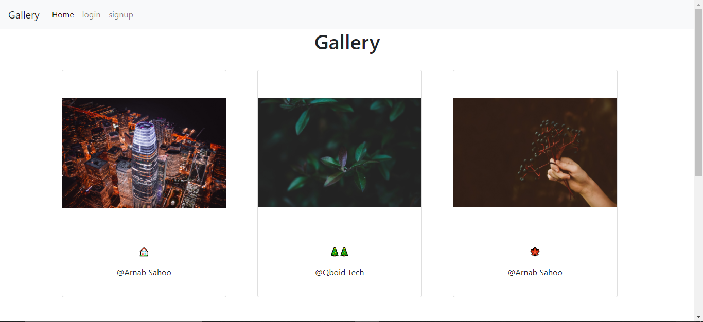
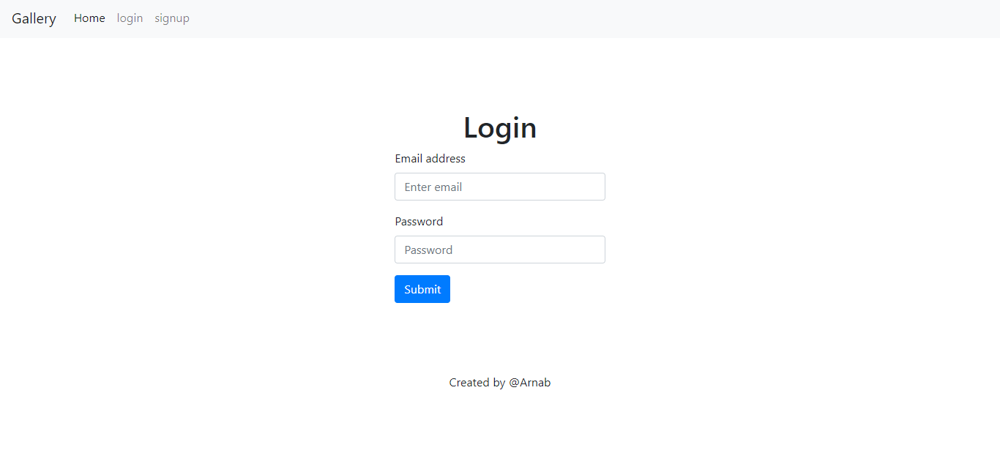
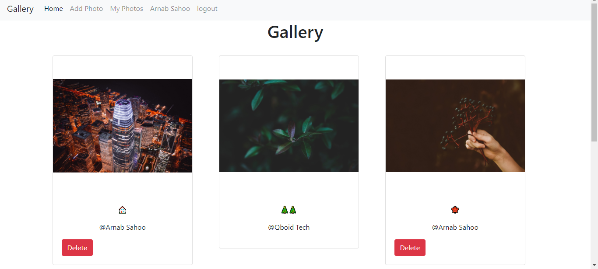
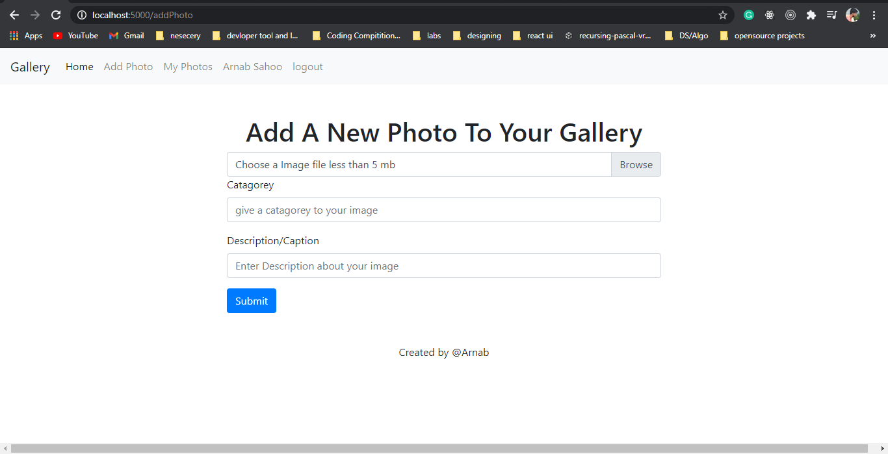
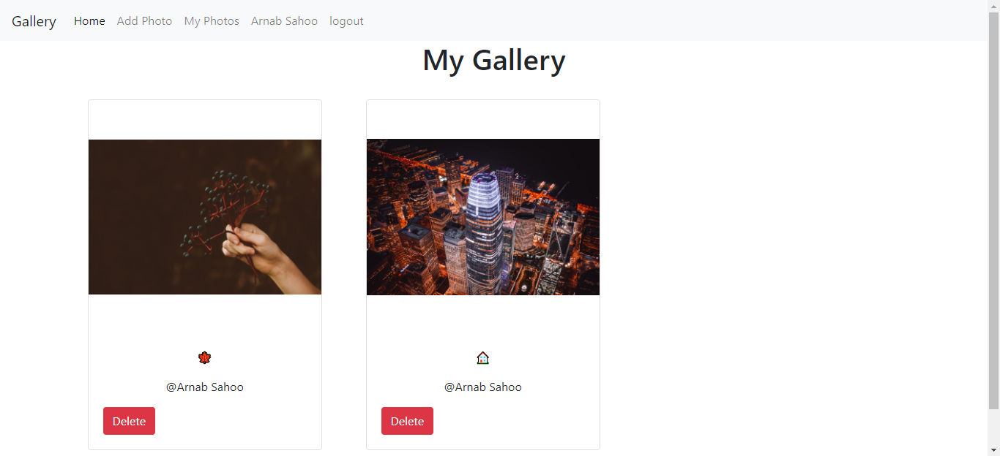

# Photo gallery 
## I devloped This web application for my shopify 2021 summar backend devlopment internship program
---

### [Live website link](https://gallery-web.herokuapp.com/)
##### *** As i deployed it on heroku so it will not show previously stored images as after restart heroku deletes stored files that are generated after deployment to heroku *** 

----
----
## still currently working upon updates
- Trying to store image data in Any cloud storage bucket as in memory storing image reduce the performance
- trying to Implement search functionality 
- trying to multiple image upload and delete funtionality
----
#### Used technologies
- node js
- mongodb
- expressjs
- ejs
- passportjs for cookie and session based authentication
- multer for file uploading
- it basicaaly stored the images in server disk after uploading the image
### how to use it in your local Mechine
1. clone or download this rero
2. download and install mongodb and run it in your local devlopment setup
3. run `npm install`
4. set devlopment Environment
5. mac/linux :- export NODE_ENV=devlopment / windows cmd:- SET NODE_ENV=devlopment / PowerShell:- $env:NODE_ENV="devlopment"
6.  create .env file in working directory then define
7.  PORT=port you want to use
8. DB_URL=mongodb://localhost/image-gallary
9. SESSION_SECRET=your session secret
10. then save .env file
11. now run `npm run dev`
 

 ### How it work
 
In home page anyone who visit website can see peoples uploaded images they can not upload any image untill they login/sign up to the application 

 
 ## Homepage

 

 

 ## login and signup page
 

 

 ### After login /signup if user can upload an image less than 5mb and loged in use can delete his/her previously uploaded image only which he/she had uploaded they can not delete other users uploaded image they can only delete the image which only they had uploaded

 ---

 
---

 #### Add Photo
 
Users can upload photos if they loged in they can upload image, image categorey ,image description/caption

 

 ## My photos

 #### In my photos only loged in users can see their previously uloaded images and also they can delete their previous images in my gallery section 

 

